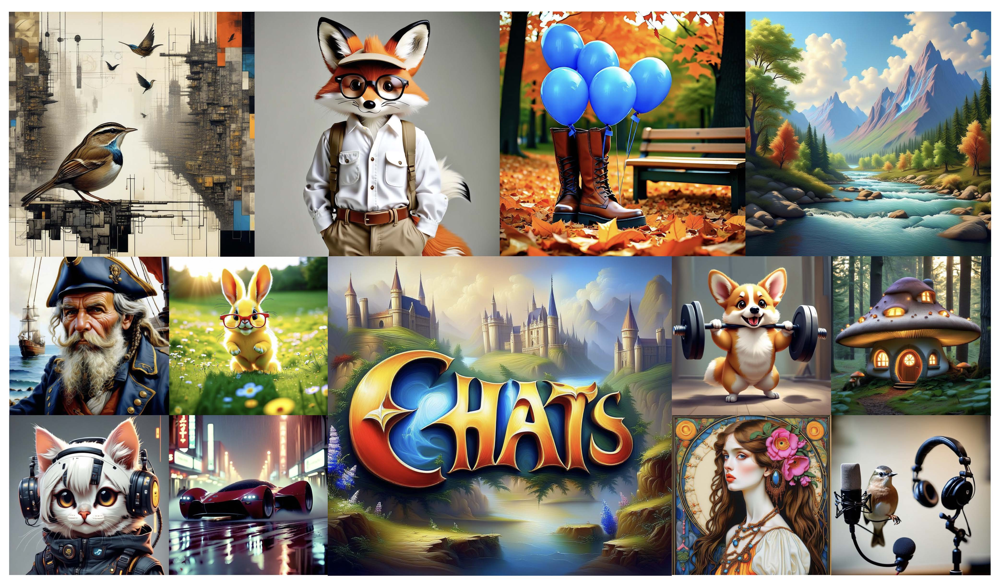

# CHATS: Combining Human-Aligned Optimization and Test-Time Sampling for Text-to-Image Generation (ICML2025)

<p align="center"> 
📝 <a href="https://arxiv.org/abs/2502.12579" target="_blank">Paper</a>  • 💡 <a href="https://zhuanlan.zhihu.com/p/1904156278621737628" target="_blank">知乎</a> • 🤗 <a href="https://huggingface.co/AIDC-AI/CHATS" target="_blank">HF Repo</a> 
</p>

CHATS is a next-generation framework that unifies human preference alignment with classifier-free guidance by modeling both preferred and dispreferred distributions and using a proxy-prompt-based sampling strategy for superior text–image alignment, fidelity, and aesthetic consistency. See the images generated below for examples.


<figure>
  
  <figcaption style="text-align: center;">Generation examples using CHATS (cf. Fig.1 in our paper).</figcaption>
</figure>

---

## 🚀 Key Features

- **Human-Aligned Fine-Tuning with CFG Integration**  
  We integrate human preference alignment with classifier-free guidance sampling into a unified framework.

- **Proxy-Prompt Sampling**  
  Leverage useful signals from both preferred and dispreferred distributions at test time.

- **Data Efficiency**  
  State-of-the-art results across benchmarks with minimal fine-tuning effort on a small, high-quality dataset.

- **Plug-and-Play**  
  Compatible with any diffusion backbone and existing guidance methods.

---

## 📦 Installation

```bash
git clone https://github.com/AIDC-AI/CHATS.git
cd CHATS
pip install -r requirements.txt

```

## 📂 Model Checkpoints

We provide pretrained CHATS checkpoints on SDXL for easy download and evaluation:
 
- **Model Repository**: [](https://huggingface.co/AIDC-AI/CHATS)


## 🛠️ Quick Start

```python
from pipeline import ChatsSDXLPipeline

# Load CHATS-SDXL pipeline
pipe = ChatsSDXLPipeline.from_pretrained(
        "AIDC-AI/CHATS",
        torch_dtype=torch.bfloat16
    ).to("cuda")

# Generate images
images = pipe(
    prompts=["A serene mountain lake at sunset"],
    num_inference_steps=50,
    guidance_scale=5,
    seed=0
)

# 4. Save outputs
for i, img in enumerate(images):
    img.save(f"output_{i}.png")
```

## 🏋️ Training

To train CHATS from scratch or fine-tune on your own data, run:

```bash
accelerate launch --config_file=config/ac_ds_8gpu_zero0.yaml  train.py \
        --pretrained_model_name_or_path=stabilityai/stable-diffusion-xl-base-1.0 \
        --pretrained_vae_model_name_or_path=madebyollin/sdxl-vae-fp16-fix \
        --resolution=1024 \
        --dataloader_num_workers 16 \
        --train_batch_size=1 \
        --gradient_accumulation_steps=16 \
        --max_train_steps=6000 \
        --learning_rate=3e-09 --scale_lr --lr_scheduler=constant_with_warmup --lr_warmup_steps=100 \
        --mixed_precision=bf16 \
        --allow_tf32 \
        --checkpointing_steps=100 \
        --output_dir=output \
        --resume_from_checkpoint latest \
        --use_adafactor \
        --gradient_checkpointing \
        --dataset_name=data-is-better-together/open-image-preferences-v1-binarized \
```

### Args:
- config_file: This DeepSpeed parameter allows you to specify the configuration file. If you wish to adjust the number of GPUs used for training, simply change the value of **num_processes** in the ac_ds_xgpu_zero0.yaml file to reflect the desired GPU count.
- pretrained_model_name_or_path: name or patch of unet model to load
- pretrained_vae_model_name_or_path: v=name or patch of vae model to load
- max_train_steps: max steps to train_batch_size
- output: output dir
- dataset_name: the huggingface sufix of the selected dataset (e.g. OIP)


## 📚 Citation

If you use CHATS, please cite our ICML 2025 paper:

```bibtex
@inproceedings{fu2025chats,
title={CHATS: Combining Human-Aligned Optimization and Test-Time Sampling for Text-to-Image Generation},
author={Fu, Minghao and Wang, Guo-Hua and Cao, Liangfu and Chen, Qing-Guo and Xu, Zhao and Luo, Weihua and Zhang, Kaifu},
booktitle={International Conference on Machine Learning (ICML)},
year={2025}
}
```

## 🙏 Acknowledgments

The code is built upon [DiffusionDPO](https://github.com/SalesforceAIResearch/DiffusionDPO), [Diffusers](https://github.com/huggingface/diffusers), and [Transformers](https://github.com/huggingface/transformers).

## 📄 License

The project is released under Apache License 2.0 (http://www.apache.org/licenses/LICENSE-2.0, SPDX-License-identifier: Apache-2.0).

## 🚨 Disclaimer

We used compliance checking algorithms during the training process, to ensure the compliance of the trained model to the best of our ability. Due to complex data and the diversity of language model usage scenarios, we cannot guarantee that the model is completely free of copyright issues or improper content. If you believe anything infringes on your rights or generates improper content, please contact us, and we will promptly address the matter.
